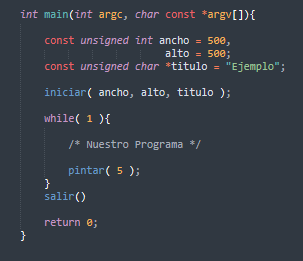

# Render
Render.h es una librería básica de dibujados de ventanas win32.

De esta manera iniciamos al motor grafico.
 

 
sus palabras claves son faciles de entender y ejecutar.
   

# Funciones:
 
loopinit( void );
 
DETECTA SI LA VENTANA/RENDER ESTA YA ACTIVADA
  

iniciar( int ancho, int alto, const char* titulo );
 
INICIA LA VENTANA/RENDER
  

pintar( int espera );
 
LLAMA A PINTAR Y TIRA EL DIBUJO A LA VENTANA/BUFFER
  

salir( void );
 
CANCELA LA VENTANA ELIMINA BUFFER Y SALE DEL RENDER
  

deltatime( void );
 
DEVUELVE EL VALOR DEL (RETARDO DEL DIBUJADO/DELTA TIME)
  

pintarblur( int espera );
 
LLAMA A PINTAR Y TIRA EL DIBUJO A LA VENTANA/BUFFER CON EFECTO BLUR/DIFUMINAR
  

@Andres Ruiz perez
@Jheison Toro Betancourth
@Daniel Efrain Quiroga
